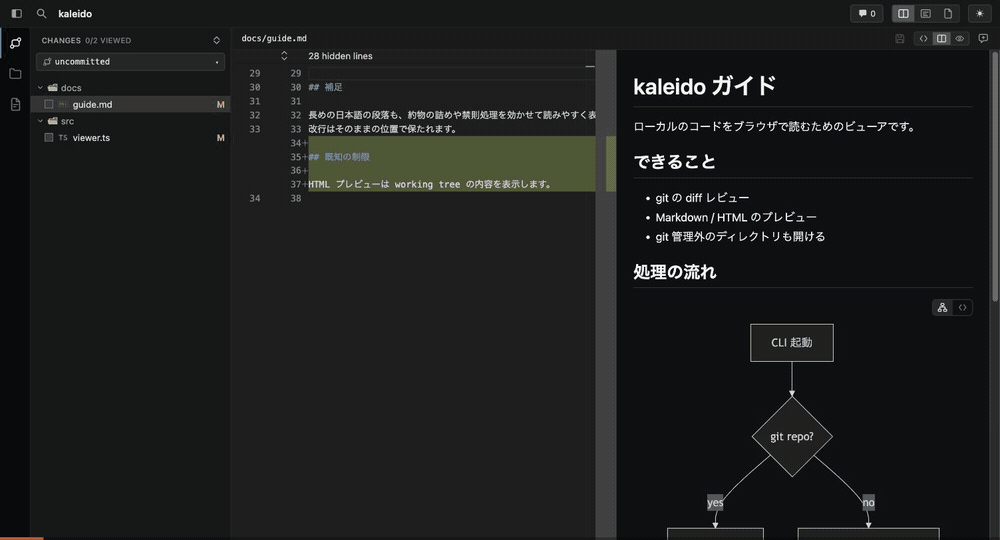
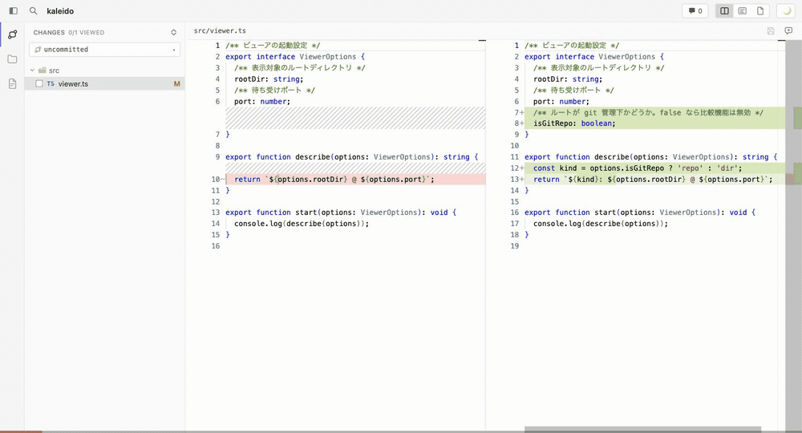

# kaleido

Monaco Editor ベースのローカル Web ファイルビューア。CLI から起動し、ブラウザで手元のファイルを読む・比較する・レビューする。

git リポジトリなら diff レビューができ、**git 管理外のディレクトリでもファイルビューアとして起動できる**。IDE を立ち上げずにブラウザでコードを読むための汎用ビューアを目指している。



### 表示 (viewer)

- **サイドバー**: VS Code と同じく左端のアイコン帯 (Activity Bar) で `Changes` (比較対象のファイル) / `Files` (ルート配下の全ファイル) / `Docs` (Markdown・HTML だけを絞り込んだ一覧。gitignore されているものも含む。更新日時順とファイル名順をヘッダのボタンで切り替えられる (更新日時順が効くのは表示中のディレクトリの直下だけで、その下は常に名前順)。基点ディレクトリをパネル上部のセレクタで絞り込め、選択はプロジェクトごとに保持される) を切り替え、その隣のパネルにツリーを出す。選択中のアイコンをもう一度押すとパネルを畳む (⌘B でも)。git 管理外では `Changes` は出ない。`Files` と `Docs` は既定で畳んだ状態で、切替先ごとに全展開 / 全折りたたみを切り替えられる。開いているファイルの階層だけは自動で開く
- **表示モード**: side-by-side diff / inline diff / ファイル単体表示を切替。比較対象外のファイルは常に working tree の内容を単体表示する
- **Markdown プレビュー**: `.md` などはソース / ソース+プレビュー / プレビューを切替。見た目は `github-markdown-css` (light / dark をテーマに追従) + 日本語の組版調整 (約物の空き詰め・禁則強化・ぶら下げ)。段落内の改行は書いたとおりに保つ (`breaks`)。既定は開いた経路で決まり、`Changes` からならソースとプレビューを並べ、`Files` / `Docs` からならプレビューのみ。幅に余裕があるときは右側に見出しの目次を出し、スクロール位置に対応する項目を強調する。` ```mermaid ` のコードブロックは図として描画し、図とソースを切り替えられる。コードブロックにはコピーボタンが付く。編集中の内容はライブで反映される
- **HTML プレビュー**: `.html` は実際にレンダリングして表示する。サーバーの `/preview` から配信するため、相対パスの CSS / JS / 画像もそのまま読め、**スクリプトも動く**。working tree のファイルを見せる仕組みなので、過去のコミットの内容を表示しているときはプレビューを出さない
- **本物の TypeScript 型情報ホバー**: サーバー側で対象プロジェクトの tsconfig + node_modules を使って `ts.LanguageService` を起動し、hover / 型エラー / 定義ジャンプ / Find All References を提供 (Monaco 内蔵 TS ワーカーは不使用)
- **ESLint 診断**: プロジェクトの `node_modules/.bin/eslint` を実行して行マーカー表示 (working tree を見ている範囲のみ)
- **編集**: working tree のファイルはエディタ上で直接編集・保存できる。ファイル名はヘッダのボタンでコピーできる
- **Quick Open** (⌘P) とファイルツリーはどちらも同じ全ファイル一覧を使う
- **自動リロード**: ファイル変更を watch して SSE で反映
- **設定ダイアログ**: ツールバーの歯車から開く。`Appearance` で配色 (既定は OS の設定に追従。切り替え後も OS 側の変更を拾う)、`About` でバージョンと依存パッケージのライセンス一覧を表示する

### レビュー (git リポジトリのみ)

- **比較範囲の切替**: working tree / staged / commit / branch (merge-base) を `Changes` パネル上部のセレクタから変更
- **レビュー済みマーク**: 内容のハッシュをキーに保存。比較範囲を切り替えても同一内容なら既読を維持
- **行/範囲コメント**: エディタ内インライン表示 + コメント一覧パネル。difit 互換形式で AI プロンプトとしてコピー可能
- コメント・レビュー済み状態は **サーバー側でファイル保存** (`~/Library/Application Support/kaleido` / XDG data dir)。ブラウザを変えても保持される



## 使い方

位置引数は「ディレクトリ」または「比較範囲」。ディレクトリとして存在し、かつ commit-ish として解決できない引数はディレクトリと解釈する
(`working` / `staged` / `.` は常に特殊キーワード。衝突するときは commit-ish が優先されるので、`--dir` で明示できる)。

```bash
kaleido                     # cwd。git 管理下なら自動判定、そうでなければファイル閲覧モード
kaleido ./docs              # そのディレクトリを開く (git の toplevel でなければ閲覧のみ)
kaleido --dir ../other      # ディレクトリの明示指定

kaleido working             # unstaged changes (index vs working tree)
kaleido staged              # staged changes (HEAD vs index)
kaleido <commit>            # そのコミットの diff (<commit>^ vs <commit>)
kaleido <target> <base>     # 任意の比較 (base vs target)

kaleido comments [target] [base]   # 保存済みコメントを AI プロンプト形式で stdout に出力
kaleido comments --json            # JSON で出力
```

引数なしで git 管理下にいる場合の自動判定: staged 変更あり→staged / working 変更あり→全 uncommitted / どちらもなし→直近コミット。

サーバー終了時 (Ctrl-C / 全タブクローズでの自動終了) にも、その範囲のコメントをターミナルに出力する。
比較範囲と表示中ファイルは URL クエリ (`?target=&base=&path=`) に同期されるため、リロード・共有できる。

オプション:

| オプション | 説明 |
|---|---|
| `--port <port>` | 使用ポート (既定 4890、埋まっていれば自動加算) |
| `--host <host>` | バインドホスト (既定 127.0.0.1) |
| `--dir <path>` | 対象ディレクトリ (既定 cwd)。`--repo` は別名 |
| `--exclude <pattern>` | ファイル一覧から隠すパターンを追加 (繰り返し可) |
| `--no-open` | ブラウザを自動で開かない |
| `--no-keep-alive` | 全タブが閉じられたらサーバーを終了する |

キーボード: `j` / `k` でファイル移動、`v` でレビュー済みトグル (次ファイルへ自動移動)、⌘P で Quick Open、⌘B でサイドバー、⌘S で保存。

### ファイル一覧の除外設定

`Files` タブと Quick Open の一覧は、既定で `node_modules` / `.git` / `dist` / `build` / `.next` / `__pycache__` などのビルド成果物・依存ディレクトリを除外する
(git リポジトリでは加えて gitignore が効く)。ルートディレクトリ直下に `.kaleido.json` を置くと上書きできる。

```json
{
  "exclude": ["docs/generated", "**/*.min.js"],
  "useDefaultExcludes": true,
  "maxFiles": 20000
}
```

- `exclude`: 追加の除外パターン。`/` を含まないパターンは任意階層のベース名にマッチする (gitignore 風)。`*` はセグメント内、`**` は階層をまたぐ
- `useDefaultExcludes`: `false` にすると既定の除外リストを使わない (`.git` のみ除外)
- `maxFiles`: 一覧の件数上限。超えると打ち切って UI に警告を出す

## 開発

```bash
pnpm install
pnpm dev                          # API サーバー (tsx watch) + vite dev server
KALEIDO_TARGET_DIR=../some-dir pnpm dev -- HEAD~5   # 対象ディレクトリ・範囲を指定
pnpm typecheck
pnpm build                        # tsup (cli/server) + vite build (client)
node dist/cli/index.js --dir ../some-dir
```

## アーキテクチャ

```
src/
├── shared/    # クライアント・サーバー共有型 (RangeSpec, DiffFileMeta, Comment, Diagnostic...)
├── cli/       # commander エントリ。引数解釈 (ディレクトリ/範囲) → サーバー起動 → ブラウザオープン
├── server/    # Hono
│   ├── files/     # git 非依存のファイル層: 本文の読み書き, ディレクトリ走査, 除外設定
│   ├── git/       # simple-git による diff 取得と ref 一覧 (git 管理外では未使用)
│   ├── ts/        # ts.LanguageService 管理 (最近傍 tsconfig 探索, overlay, warm-up)
│   ├── store/     # コメント / viewed の JSON 永続化 (atomic write)
│   ├── eslint.ts  # プロジェクトの eslint を --format json で実行
│   └── watcher.ts # @parcel/watcher + SSE
└── client/    # React 19 + Monaco
    ├── monaco/    # ワーカー構成 (editor worker のみ)、hover provider proxy、markers
    └── components/ # DiffEditor 1 インスタンス + サイドバー (Changes/Files) + ViewZone コメント
```

設計上のポイント:

- **TS ワーカーを一切バンドルしない**: `monaco-editor/features/register.all` (エディタ機能) と `languages/definitions/*` (monarch ハイライトのみ) を個別 import。型情報は `/api/lang/hover` への proxy provider で供給
- **型ホバーは modified 側のみ**: old 側は依存の当時状態を再現できず誤情報になるため。staged/commit 比較時は表示中の全文を overlay として添付し「approximate」注記付きで表示
- **TS 本体は対象プロジェクトのものを優先**: `require.resolve('typescript', { paths: [repo] })`。TS7 (native) は LanguageService API が無いため同梱の TS5 にフォールバック
- **表示は DiffEditor 1 インスタンスに集約**: ファイル切替はモデル差し替えで行う。Markdown / HTML プレビューのようなエディタでない表示モードを足す場合は、この 1 インスタンスの外側に並置するビューとして持つ想定
- **git は「あれば使う」層**: ルートが git の toplevel でなければ `gitDiff` / `gitRefs` は `null` になり、比較 API は空を返す。ファイル本文は常に working tree をファイルシステムから読むため、閲覧・編集・型情報は git の有無に依存しない
- **比較なしの状態も擬似 range で表現**: `{ target: 'browse', base: 'browse' }` を 1 つの範囲として扱うことで、コメント保存キー・URL 同期・クエリキャッシュを diff モードと共通化している
- **HTML プレビューはページを動かす前提で隔離**: `/preview/<path>` から配信し、`allow-scripts` 付き・`allow-same-origin` なしの iframe で読み込む。opaque origin になるのでビューア本体の DOM や localStorage には触れられず、加えて `/api/*` は `Origin` ヘッダを見て別オリジンからのリクエストを 403 にする (プレビュー中のページから `/api/file/save` を叩かれないように)。ページ自身のファイルは fetch できるよう `/preview` のレスポンスにだけ `Access-Control-Allow-Origin: *` を付ける
- **Markdown プレビューは sandbox iframe に隔離**: marked は生の HTML を素通しするため、`allow-same-origin` を与えない iframe に `srcdoc` で流し込む。コピーボタンのために `allow-scripts` は付けるが、CSP の `script-src 'nonce-…'` でこちらが入れた 1 本以外は実行させず、`connect-src 'none'` で通信も塞ぐ。図とソースの切り替えはスクリプトを使わず checkbox + 兄弟セレクタで行う。mermaid は iframe 内で動かせないので、親側で SVG に変換した結果だけを埋め込む (`securityLevel: 'strict'` でラベル内 HTML をサニタイズ)。スタイルは `github-markdown-css` を `?inline` で文字列として取り込み、テーマに応じて light / dark を `<style>` に埋め込む。開いているファイルのスクリプトが同一オリジンで動いて `/api/file/save` などを叩くことはない。相対画像は `/api/raw` (画像の Content-Type のみ、`nosniff` 付き) 経由で表示し、相対リンクはそのファイルをビューアの新しいタブで開く
